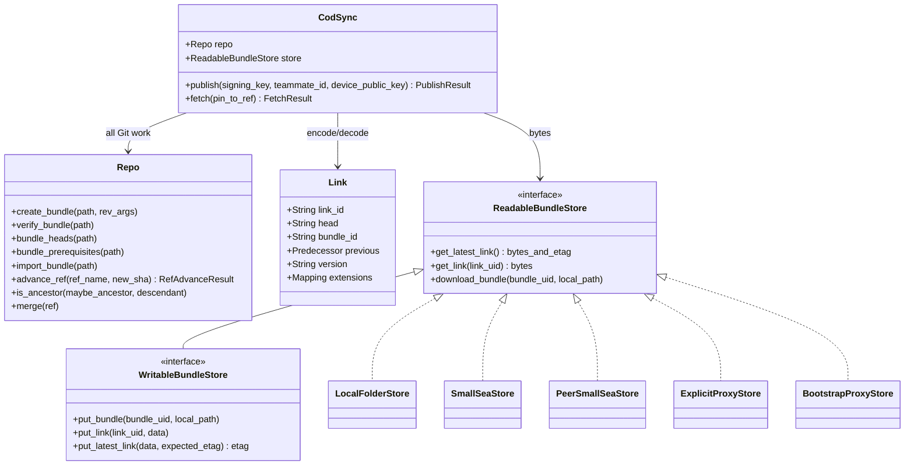

- `synthesize_new_user`

Git remote stuff:

smallsea://user/alice
smallsea://team/alice/friends
smallsea://app/alice/supernotes
smallsea://app-team/alice/supernotes/friends


Link file shape (version 2, see `packages/cod-sync/Documentation/format-spec.md`):

```yaml
version: 2.0.0
link_id: 0123456789abcdef
head: <main commit object id>
bundle_id: fedcba9876543210
previous:
  link_id: 1111111111111111
  head: <previous main commit object id>
extensions: {}
```

The first link in a chain has `previous: null`.

# Class Diagram: Software Architecture

We'll create a visual representation of the main software components and their relationships.

## Classes

1. **CodSync** (`cod_sync/protocol.py`)
   - Coordinates publication and fetch. Executes no Git command and parses no YAML itself.
   - Constructed as `CodSync(repo, store)`.
   - Methods:
     - `publish() -> PublishResult`
     - `fetch(pin_to_ref=None) -> FetchResult`

2. **Repo** (`cod_sync/repo.py`)
   - Owns every Git operation, including bundle creation, inspection, import, and forward-only ref movement.

3. **Link / BundleDescriptor** (`cod_sync/format.py`)
   - The version-2 link model and its wire codec, plus canonical signing.
   - Functions: `encode_link()`, `decode_link()`, `canonical_link_bytes()`, `sign_link()`, `verify_link_signature()`.

4. **ReadableBundleStore / WritableBundleStore** (`cod_sync/store.py`)
   - Opaque byte transport. Reads report exact absence separately from every other failure.
   - Read methods: `get_latest_link()`, `get_link(uid)`, `download_bundle(uid, path)`.
   - Write methods: `put_bundle(uid, path)`, `put_link(uid, data)`, `put_latest_link(data, expected_etag)`.

5. **Store implementations**
   - `LocalFolderStore`; the Hub-backed `SmallSeaStore`, `PeerSmallSeaStore`, `ExplicitProxyStore`, and `BootstrapProxyStore`.
   - `S3Store` and `PublicS3Store` in `cod_sync/testing.py` are test infrastructure, not production transports.

6. **GitCmdFailed** (`cod_sync/git.py`)
   - The low-level Git failure; `Repo` wraps it as `RepoError` and its subclasses.

## Relationships

The module dependency graph runs one way: `git.py` <- `repo.py` <- `protocol.py`,
with `protocol.py` also depending on `format.py` and `store.py`, which do not depend on each other.

### Class Diagram (Mermaid Syntax)


