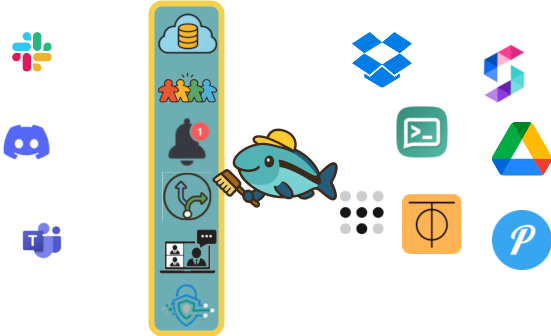

#  Small Sea Collective

### Local-_First_, General-Purpose Services _Second_

Around 2020 the local-first community coalesced around discontent with cloud-oriented software architectures and SaaS business models.
"[Local-first software](https://www.inkandswitch.com/essay/local-first/)" from Ink & Switch is widely seen as the community's founding manifesto.
(If you're unfamiliar with local-first, skimming the Ink & Switch essay will help contextualize the Small Sea project.)

Many have commented on a pragmatist-idealist spectrum in local-first.
On the pragmatist end, the backend architectures and business models are similar to established cloud-first models.
The _local-first_ part is focused on caching and lazy synchronization to support offline mode and less waiting for remote services (No Spinners!).
Pragmatic local-first is better than a poke in the eye with a sharp stick, but it fails to address some of the community's more ambitious ideals.

The Small Sea project is firmly on the idealist side.
We aim to enable the deployment of applications with little (even zero) dependence on bespoke/application-specific services.
Applications that people can use without fear of misuse of their data; with confidence that their ongoing use of the application doesn't depend on some business unit keeping the lights on.
But of course network services are essential for many features that we expect from software.
So the challenge this project takes on is decoupling applications from services.
We are building frameworks that allow a combination of client-side logic and _general-purpose_ services to play roles that are so often filled by application-specific backends today.
By general-purpose services, we mean things like:

- Internet service providers
- Storage (Dropbox, S3, etc)
- Notifications (ntfy, SuprSend, etc)
- Peer-to-peer streaming connections (Tailscale, ZeroTier, etc)
- Identity verification (certificate authorities)

To put it in visual terms, conventional SaaS application architectures look something like:

<table>
<tr>
<td></td>
<th colspan="100%" style="text-align:left;">Features →</th>
</tr>
<tr>
<th></th>
<th></th>
<th></th>
<th></th>
<th></th>
<th></th>
<th></th>
</tr>
<tr style="vertical-align:top">
<th>Apps ↓</th>
<td>Storage</td>
<td>Team Management</td>
<td>Notifications</td>
<td>Sync</td>
<td>Streaming</td>
<td>Security, Privacy</td>
</tr>
<tr>
<td></td>
<td>

  
  

</td>
<td>

  
  

</td>
<td>

  
  

</td>
<td>

  
  

</td>
<td>

  
  

</td>
<td>

  
  

</td>
</tr>
<tr>
<td></td>
<td>

  
  

</td>
<td>

  
  

</td>
<td>

  
  

</td>
<td>

  
  

</td>
<td>

  
  

</td>
<td>

  
  

</td>
</tr>
<tr>
<td></td>
<td>

  
  

</td>
<td>

  
  

</td>
<td>

  
  

</td>
<td>

  
  

</td>
<td>

  
  

</td>
<td>

  
  

</td>
</tr>
</table>

Each application implements its own version of more or less standard services.
The application and the services are bundled as a single thing.

In the Small Sea framework, the Small Sea Hub provides a collection of generic services to applications and implements those with whatever general-purpose services users subscribe to.
Application development and providing services are two different businesses.

The Small Sea Hub is **not** a remote service.
Rather it's software that runs on client devices and translates local application requests into appropriate general-purpose service interactions.
In some cases this translation is a simple pass-through; in some cases the Hub provides quite a lot of protocol smarts on top of the generic service.

## Two Technical Pillars: Team Management and Snapshot-Based 3-Way Merge

One of the known hard problems in local-first is identity/team management.
People want apps that share things with other people over the internet.
But except for the special case of totally global public sharing, it gets hard to control who gets to read and write what resources.
This is an extremely important role played by big services like MS Teams, Google Workspace, etc.

The first pillar of the Small Sea project is fully decentralized team management.
Each team member publishes their modifications of the team's data to their own cloud storage location.
Signal-inspired [cryptographic](https://signal.org/docs/specifications/x3dh/) [protocols](https://signal.org/docs/specifications/doubleratchet/) ensure only team members can read the team's data.
New members are added with a multi-step invitation process.
When members leave, key rotation ensures that they can't read future modifications.
Periodic out-of-band certificate validation helps ensure impostors aren't impersonating team members.

And a central goal is to wrap all this crypto and protocol fanciness up with an approachable UI/UX, because we know Johnny Can't Encrypt.

Synchronizing/merging/reconciling concurrent modifications to some document/database is arguably the central technical focus of the local-first community.
For example, it is one of the most common topics on the [Local-First Podcast](https://www.localfirst.fm/).
The dominant framework for sync seems to be CRDTs.
CRDTs are cool, but relying on them makes me nervous.
It feels like it's too easy to make a mistake with them that could lead to data corruption in corner cases.
And CRDTs require too much from-scratch thinking on the part of application programmers.
Schema evolution remains a not-entirely-solved problem.

The baseline sync method in Small Sea is another old friend: snapshot-based 3-way merge.
In other words, `git`.
This approach to sync is slow.
It can get inefficient quickly in the face of lots of transient data churn.
It's not appropriate for real-time concurrent editing of some doc where users want to see each others' edits immediately.
But for situations where occasional, slow sync is sufficient it has some compelling advantages:

- Full-environment snapshots are the basic unit, so it's relatively easy to avoid mixing edits together in a way that breaks some data relationship invariant (even accidental invariants)
- When reconciling concurrent changes in a clever, fine-grained way gets hard, it is easy to fall back to _pick yours_ or _pick mine_
- It's relatively easy to incrementally adapt existing software, starting with coarse yours-or-mine reconciliation and improving automatic merge logic as needed

One way to look at this is the classic N×M problem.

So to refine the motivating question: How much application functionality can be implemented by stitching together general-purpose services like these, instead of the application creator providing them directly?

### Why?

There has been a little explosion of projects in this space, and a couple of challenges have emerged as especially tricky:

- Identity, especially as it relates to sharing.
  In cloud architectures, it's natural for people to register accounts with central services.
  It's then natural for these accounts to be used as digital identities.
  Especially popular services have become de facto identity providers for a great many applications.
  Sharing between different identities within a particular ecosystem can be managed in a straightforward way by the service provider.
  In local-first architectures it's not obvious how to handle digital identity and manage sharing.
- Synchronization was recognized very early as a big challenge.
  Research on CRDTs was some of the first work in the local-first space.
  But decentralized data synchronization in its full generality is a very hard problem that is unlikely to have a one-size-fits-all solution any time soon.

The Small Sea projects leans in hard to using git as its synchronization framework.

General Purpose Services

## Obvious Caveat: General-Purpose Services Can't Do Everything

For many applications/features there's no obvious way to implement them with only general-purpose services:

- Anything with specific real-time data feeds (traffic, weather, stock prices, etc)
- E-commerce
- Broadcast-to-the-universe style social media

Small Sea is not an attempt to re-implement these things in a different style.
It's for apps where small groups of people share and collaborate among each other.

## If Not SaaS How will Devs Feed their Families?

SaaS business models are overwhelmingly dominant in software development today, but it has not always been thus.
I am not opposed to developers getting paid for their efforts.
But I don't think SaaS models are the only way.
If Small Sea is successful, maybe new models will emerge.
And a nice feature of the model is that it requires no operating costs on the part of application authors.
So even if the model is only modestly successful, it might open the door to some applications that aren't getting made today.

## What About My Favorite Sync Engine?

In the local-first community, sync engines are a common topic of conversation.
Details vary somewhat, but what I mean is any service that facilitates synchronization between nodes that are concurrently modifying some document/database.
I'm not sure it's feasible to make a sync server that does not see the contents of the data it's syncing.
And that's something I'm really trying to avoid.
Maybe in the future a really hands-off general purpose sync engine protocol will emerge.
But for the time being, I don't think such a thing exists.

## The Name 'Small Sea Collective'

Some day we'll all be connected _through_ the overlapping groups that we're deeply connected to (family, work, faith, neighborhood, hobby) in one big web.
Making the great big interwebs into a small sea.
Also there are several words for which "small 'c' ___" is an appropriate description of the project.
