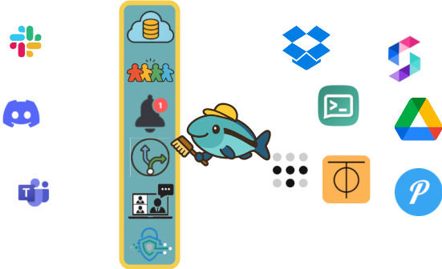

#  Small Sea Collective

### Local-first for teams that outlast startups

Small Sea Collective is a framework that brings the [local-first](https://www.inkandswitch.com/essay/local-first/) paradigm to team collaboration. We aim to enable the deployment of applications that people can use without depending on some company's bespoke service; with confidence that their ongoing use of the application doesn't depend on some business unit keeping the lights on.

Our challenge is making it possible to build rich applications with _general-purpose_ services, decoupling applications from services. These general-purpose services include:

- Internet service providers
- Storage (Dropbox, S3, etc.)
- Notifications (ntfy, SuprSend, etc.)
- Peer-to-peer streaming connections (Tailscale, ZeroTier, etc.)
- Identity verification (certificate authorities)

In visual terms, while conventional SaaS application architectures look like this:

<table>
<tr>
<td></td>
<th colspan="100%" style="text-align:left;">Features →</th>
</tr>
<tr>
<th></th>
<th></th>
<th></th>
<th></th>
<th></th>
<th></th>
<th></th>
</tr>
<tr style="vertical-align:top">
<th>Apps ↓</th>
<td>Storage</td>
<td>Team Management</td>
<td>Notifications</td>
<td>Sync</td>
<td>Streaming</td>
<td>Security, Privacy</td>
</tr>
<tr>
<td></td>
<td>

  
  

</td>
<td>

  
  

</td>
<td>

  
  

</td>
<td>

  
  

</td>
<td>

  
  

</td>
<td>

  
  

</td>
</tr>
</table>

The Small Sea Hub provides a collection of generic services to applications and implements those with whatever general-purpose services users subscribe to.

The Small Sea Hub is **not** a remote service. Rather, it is software that runs on client devices and translates local application requests into appropriate general-purpose service interactions.

That gateway rule still allows one device's Hub to talk directly to another
device's Hub, including over future VPN-style paths. The important boundary is
that Small Sea apps and internal packages do not bypass their local Hub.

## Why?

Small Sea Collective addresses two big challenges for local-first software:
1.  **Identity and Sharing**: Decentralized identity linked to team membership, allowing people to share resources securely without a central authority.
2.  **Synchronization**: A reliable, safe synchronization framework ("Cod Sync") based on git, allowing applications to be built on top of familiar version-control metaphors.

That decentralization is meant literally: there is no central authority over a
team's membership or permissions, and different participants' local views can
diverge. Small Sea provides shared history and protocol conventions, not a
single forced global answer.

For more technical details, see [Architecture](architecture.md).

## What Small Sea is Not

- **Real-time feeds**: Small Sea is not for stock prices, traffic, or weather.
- **E-commerce**: Small Sea is not for public shopping platforms.
- **Broadcast social media**: Small Sea is not for broadcasting to the universe (e.g. X/Twitter).

It is designed for small groups of people who share and collaborate among themselves.

## The Name 'Small Sea Collective'

Some day we'll all be connected _through_ the overlapping groups that we're deeply connected to (family, work, faith, neighborhood, hobby) in one big web. Making the great big interwebs into a small sea.
