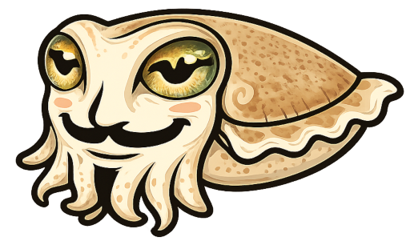

# Cuttlefish — Small Sea Session Crypto

Cuttlefish is the Small Sea package for session and transport cryptography.
It covers the Signal-inspired machinery used to bootstrap pairwise sessions
and encrypt team data, while the separate `wrasse-trust` package owns
identity, certificates, ceremonies, and trust-chain logic.

## Scope

Cuttlefish currently owns:

- X3DH-style prekey bundles and session bootstrap
- Double Ratchet for pairwise channels
- Sender Keys for team broadcast encryption

Cuttlefish does **not** own the BURIED/GUARDED/DAILY identity hierarchy or the
web-of-trust model. Those live in `wrasse-trust`.

## Module Map

- `cuttlefish.prekeys` — X3DH prekey bundles and bootstrap key material
- `cuttlefish.x3dh` — asynchronous pairwise key agreement
- `cuttlefish.ratchet` — Double Ratchet session state and message encryption
- `cuttlefish.group` — Sender Keys group encryption

## Design Notes

Small Sea follows Signal-style layering:

- prekey bundles make offline initiation possible
- X3DH establishes a shared secret
- Double Ratchet provides forward secrecy and post-compromise recovery
- Sender Keys make team broadcast efficient

**Sender key state is a protocol-layer access convention, not a cryptographic
enforcement boundary.** Distributing a sender key to a party signals that they
are expected to be a legitimate reader; it does not prevent an admitted party
from relaying plaintext or receiver state to others. Read access is therefore
endpoint-trust-scoped.

**Admission flows determine who holds sender key state.**

*Linked-device admission* is a unilateral identity-owner act: the existing
sibling runs a bootstrap flow, hands the new device its snapshot of peer sender
keys (giving join-time-forward access across all senders the sibling held), and
publishes a `device_link` cert. No per-sender redistribution ceremony is
required.

*Teammate admission* is an inviter-orchestrated admin-quorum flow. Key facts
for cuttlefish consumers:

- The **inviter allocates the invitee's `member_id`** at proposal creation. The
  invitee binds to it in their signed acceptance blob but does not choose it.
- Every proposal is anchored to a **team-history commit hash** that freezes the
  admin roster, membership roster, and member→device mapping at that snapshot.
- The **proposal shell is published before the invitee is contacted**, giving
  other admins in the frozen governance set early visibility to approve or
  withhold.
- The **admission transcript** binds the invitee's concrete device keys and the
  pre-allocated `member_id`. Transport metadata (cloud endpoints) is explicitly
  excluded; post-admission transport setup is a separate flow.
- The **inviter observes quorum met and publishes finalization**. The invitee
  never publishes their own admission.
- Admin approvals are validated via the **member/device bridge**: an approval
  is valid iff the signing device key appears in a `device_link` cert at the
  anchor that maps to a current-admin `member_id`.

**Rotation serves exclusion and hygiene only; it is never used to admit a new
party.** See `architecture.md` §1 for the full model.

The Hub's crypto surface stays narrow:

- The **Hub** depends on `cuttlefish.group` for encrypted team sessions.
- The **Manager** depends on `cuttlefish.group` and `cuttlefish.ratchet` for
  key distribution and pairwise encrypted coordination.

## Relationship to Wrasse Trust

`cuttlefish.prekeys.IdentityKeyPair` is deliberately narrow: it is the X25519 +
Ed25519 bootstrap identity needed for session establishment. It is not the same
thing as the richer trust-side identity model in `wrasse-trust`, which handles
certification, revocation, ceremony exchange, and trust traversal.
