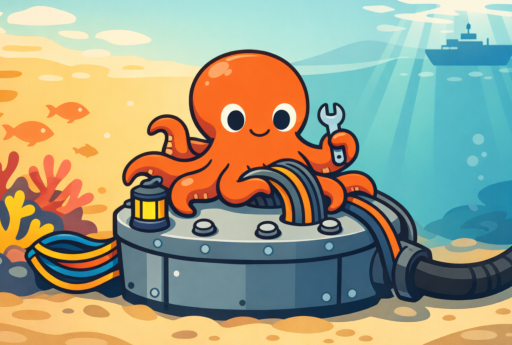

# Small Sea Hub

The Hub is the connector between Small Sea clients and internet services (cloud storage, notifications, VPNs, etc).
Its primary purposes are:

1. Abstract away the details of particular service providers (e.g. Dropbox vs OneDrive) wherever possible
2. Implement parts of the Small Sea protocol like session encryption
3. Provide read-only access to Small Sea metadata (teams, devices, etc) to local clients

The Hub is generally not responsible for any policy decisions or complex logic, like processing team invitations.
Those things are handled by the Small Sea Manager.
