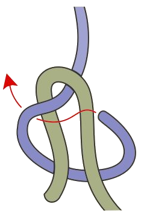
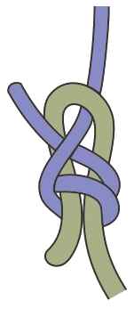

# Splice Merge

The purpose of this package is to support 3-way merge of nontrivial data formats.
It is not a complete merge solution for any particular format.

In particular Splice Merge is intended to work with a few patterns:

1. Objects whose identity cannot be 100% reliably determined based on its contents should have a statistically unique ID.
   - For example, think two identical events added concurrently to a calendar by two different people.
   - Recommended: UUIDv7 or similar.
2. Rather than merging raw stored data, prefer an export/canonicalize, merge, import cycle.
   - Canonicalizing data makes it easier for simple merge algorithms to perform well.
   - Splice Merge is not designed for low-latency use cases such as real-time collaborative editing. It is for cases where it is okay to trade speed for accuracy and reliability.
3. For files that might be large, prefer scanning versions simultaneously
   - Handle merging of objects independently
4. For 'large' objects, add a hash of its contents for quick comparison.

## Preliminary note on LLM assistance

LLMs do not fundamentally move distributed synchronization from impossible to possible.
The hard parts of merge still need principled data modeling, stable identity, deterministic algorithms, validation, and clear conflict surfaces.

But LLMs may change the cost curve enough to matter for application makers.
Fully distributed synchronization has seen modest use partly because centralized services make so many things cheaper:
one current database state, one authority for conflict resolution, one observability surface, and one operational model.
Distributed systems ask developers to spend much more attention on merge projections, adapters, fixtures, invariants, conflict types, and user-facing repair paths.

That attention cost is where LLMs may help.
At design time, coding agents can assist with the tedious and error-prone work of building export/import functions, generating adversarial micro tests, and keeping merge projections aligned with application models.
At runtime, small local models may be useful as optional helpers for rare semantic conflicts, proposing resolutions for structured conflict objects rather than deciding merges over raw application data.

One way to frame the runtime role:
when an application performs a merge, it must sort each conflict into an escalation tier.
Resolve it cleanly with no user involvement, surface a "pick this or that" choice, or in the worst case declare the merge a lost cause and fall back to a known-good version.
The hope for LLM assistance is not a new merge authority but a shift in the thresholds between tiers:
some conflicts that would have interrupted the user get resolved cleanly, and some that would have been lost causes become pickable choices.
Because deterministic code still owns admissibility, a proposal that fails validation simply leaves its conflict in the tier it would have occupied anyway.
The worst case is the status quo without the LLM;
the model can shrink the residue of escalations but cannot add new failure modes.
Resolutions an LLM helped produce should carry provenance and be easy to revert, which version-controlled history makes cheap.

The intended shape is still conservative:
Splice Merge should work without LLMs, and deterministic code should own detection, provenance, validation, and final admissibility.
LLM assistance is best treated as icing on the cake:
a way to make principled distributed merge cheaper to build and nicer to use, not as the foundation that makes it correct.
